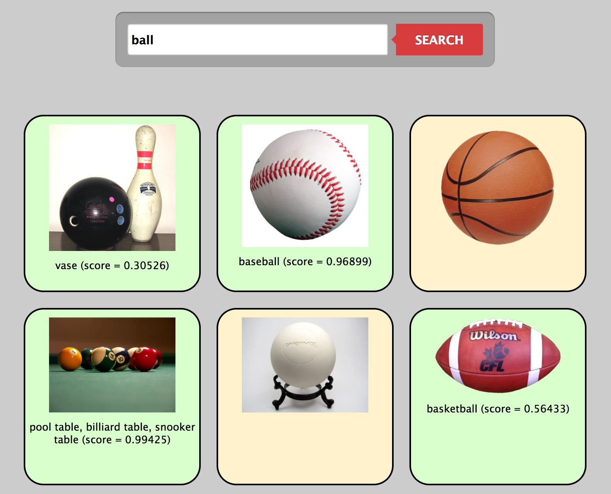

# Image Search and Tagging

The demo apps are HTTP servers designed specifically for exercising demo scenarios in Waiter.
This demo application performs image search and then tags the images using the [inception-v3 model built in tensorflow](https://www.tensorflow.org/tutorials/image_recognition).

The demo highlights the following features of Waiter:

1. Registering image search and image tagging as DNS record tokens in Waiter.

1. Running different services (image search and image tagging) on Waiter.

1. Services with different concurrency level support.

1. Invoking different services from the same client (i.e. the demo page).

1. [Scaling of services](../../waiter/docs/autoscaling.md) (image tagging).

## Running the demo

Steps to demo:

1. Launch Waiter (e.g. on port 9091) `$ lein do clean, compile, run some-config.edn`

1. Build the demo app Docker image: `$ bin/build-docker-image.sh`

1. Register the tokens for `image-search` and `image-tagging`: `$ bin/register-demo-tokens.sh`.
   The tokens use the [localtest.me](http://readme.localtest.me/) suffix.

1. Launch the demo app (e.g. on port 9095) `$ lein do clean, compile, run --port 9095`

1. Open the demo page on a browser by visiting `http://127.0.0.1:9095/demo`.

1. Perform your image search and notice the images being tagged incrementally.

   
